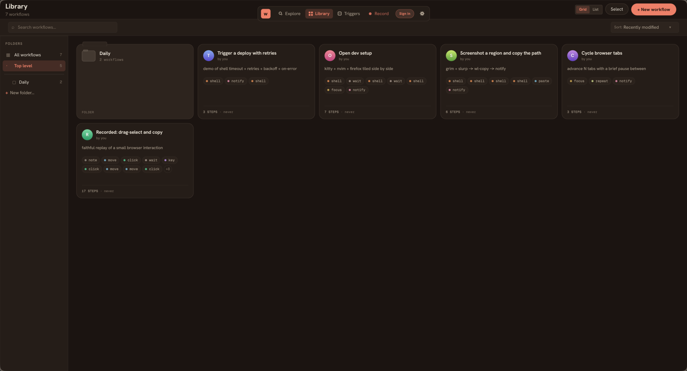
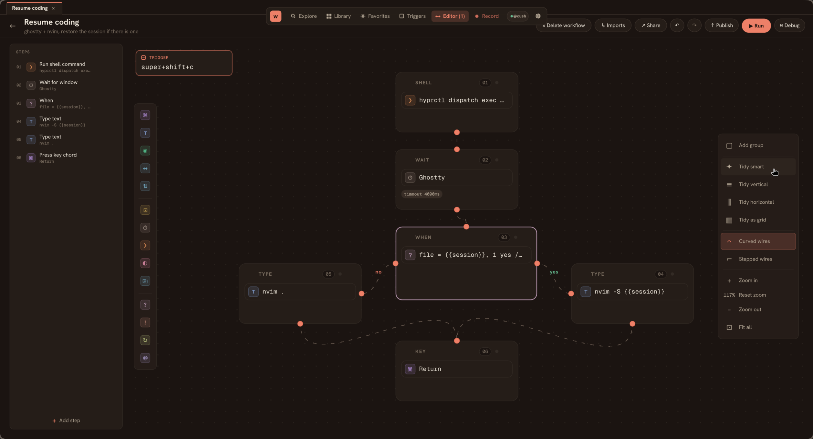
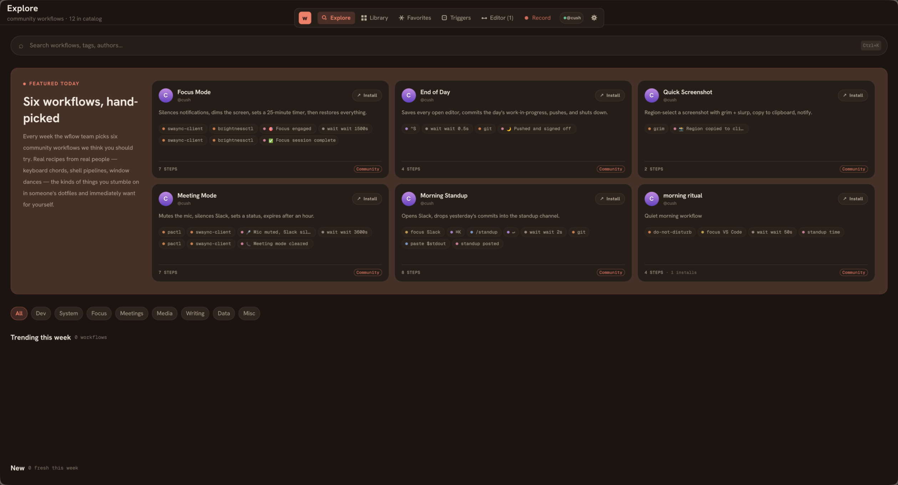
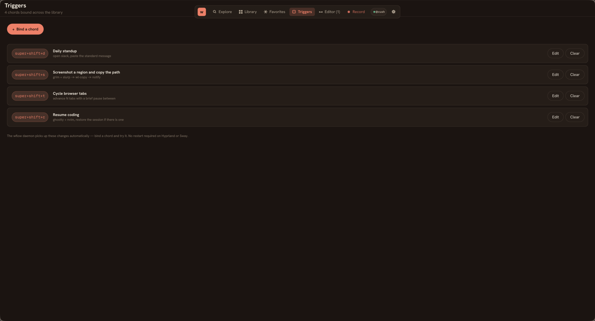
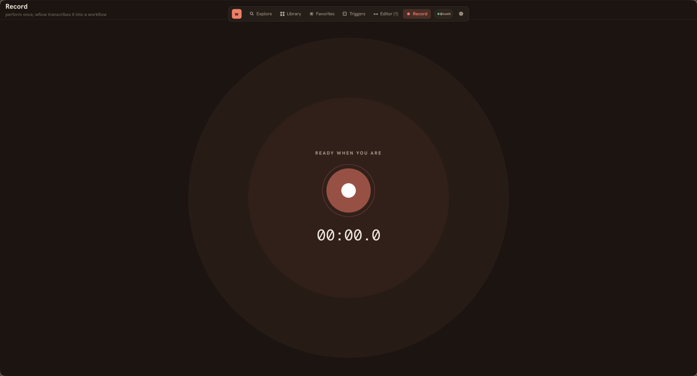

# wflow

**Shortcuts for Linux. GUI editor backed by plain-text workflow files,
a global-hotkey daemon, and a community catalog at
[wflows.io](https://wflows.io).**



A Qt Quick app for building, editing, recording, and replaying desktop
workflows on Wayland. Pick a template or start blank, edit the steps,
hit Run, watch each step report back. Or skip the editor entirely and
hand-write the file in `$EDITOR`. Both paths produce the same output.

Built on [wdotool-core](https://github.com/cushycush/wdotool) for input
injection — linked in process, no `wdotool` binary required at runtime.

## The editor

Free-positioning canvas. Drag chips from the palette dock on the left
to drop a step anywhere; wires auto-route between consecutive steps;
conditionals render as branch shapes with explicit yes/no outputs;
repeat is a container with an inline strip of inner rows. Smart Tidy
on the right-side tool dock picks the layout that keeps cards readable
at the closest-to-1.0 zoom.



The pinned trigger card at the top-left of the canvas surfaces the
chord binding for the workflow, so you don't have to read the KDL to
know what fires it. Multi-select with shift- or ctrl-click; lasso a
region with shift- or ctrl-drag; alt-drag to draw a coloured group
rectangle behind cards as a visual annotation.

Step-by-step debugger. ⏯ Debug pauses the engine between every action;
Step / Continue / Stop are the controls. The active card pulses; each
step's status dot settles to green / red / grey on outcome. Repeat
inner steps each get their own dot and pulse on every iteration so
loops are easy to read.

## Explore

A community catalog of workflows lives at
[wflows.io](https://wflows.io). Sign in from Settings → Account, browse
from the Explore tab, click any card to import it.



The detail drawer parses the inline KDL through the same decoder the
runner uses, so the step preview is exactly what the engine would
execute. Install and star counts come from the live API. Importing
shows a confirm dialog with title, author, description, and step
count before anything writes to disk — a drive-by page that opens
`wflow://import?source=...` in your browser can't silently install
something you didn't intend to keep.

When you're signed in, every card in your local Library grows a small
"↑ Publish" pill in the top-right corner. Click it, fill in the
description, tags, and visibility, hit publish, and your workflow
posts to wflows.io. The KDL on disk is the source of truth — no
copy-paste, no reformatting.

## Triggers

`wflow daemon` is a long-lived background process that binds every
chord declared in your library and dispatches the right workflow when
one fires. It picks the GlobalShortcuts portal on Plasma 6 and GNOME
46+, and falls back to compositor IPC on Hyprland and Sway.



Author chords inside each workflow's KDL (`trigger { chord
"super+shift+c" }`) or use the Triggers tab in the GUI. Either way the
daemon's file watcher picks up changes in real time on Hyprland and
Sway; portal-mode users restart the daemon to apply trigger changes
(the GlobalShortcuts portal binds shortcuts once per session by spec).

The first time you launch the GUI it offers to enable the systemd user
unit so the daemon starts on every login.

## Record

Walk through the actions you want to replay, stop, the captured stream
becomes a new workflow.



Record uses `org.freedesktop.portal.RemoteDesktop` on Plasma 6 and
GNOME 46+ (explicit consent dialog, no extra permissions). On
Hyprland, Sway, and other wlroots compositors that don't ship the
portal interface yet, Record falls back to reading
`/dev/input/event*` directly via `evdev`. That requires being in the
`input` group: `sudo usermod -aG input $USER` then log out and back
in. If neither path is available, Record shows a clear setup error
instead of silently capturing nothing.

## Install

### Arch Linux

```sh
paru -S wflow-bin          # prebuilt binary, ~5s install
paru -S wflow              # builds from source, ~5min on a fast machine
paru -S wflow-git          # tracks main, builds from source
```

`wflow-bin` is the same binary the GitHub release ships. Install it if
you want to skip the cargo build; install `wflow` if you prefer a
from-source build with your local rustc + LTO.

PKGBUILDs in [`packaging/aur/`](packaging/aur/) for local builds.

### From source

Requires Rust 1.77+ and Qt 6.11+ (`qt6-base`, `qt6-declarative`,
`qt6-quickcontrols2` on Arch; equivalents on Debian/Ubuntu).

```sh
cargo install --path . --locked
```

For desktop notifications and clipboard actions, install `libnotify`
(for `notify-send`) and `wl-clipboard` (for `wl-copy`) through your
distro. Input/window automation goes through `wdotool-core` linked
into wflow itself — no separate binary to install.

### Prebuilt tarball

Each release attaches an `x86_64-unknown-linux-gnu.tar.gz`. See the
[latest release](https://github.com/cushycush/wflow/releases/latest);
the bundled `INSTALL.txt` walks through the install. Requires Qt 6
runtime libs.

### Flatpak

Manifest is in [`packaging/flatpak/`](packaging/flatpak/). Flathub
submission lands once the last host-machine verification item closes.
For now: build locally with `./packaging/flatpak/build-local.sh`.

### Auto-start on login

```sh
# AUR / Flatpak / distro package: the unit is already at
# /usr/lib/systemd/user/wflow-daemon.service, just enable it.
systemctl --user enable --now wflow-daemon

# Source checkout / cargo install: copy the unit first.
install -Dm644 packaging/systemd/wflow-daemon.service \
    ~/.config/systemd/user/wflow-daemon.service
systemctl --user daemon-reload
systemctl --user enable --now wflow-daemon
```

`journalctl --user -u wflow-daemon` is the place to look if a chord
isn't firing. The unit is tied to `graphical-session.target` so the
daemon starts with KDE / GNOME / Hyprland / Sway and stops on logout.

If you installed via `cargo install --path .` and your user systemd
hasn't been told about `~/.cargo/bin`, edit `ExecStart=wflow daemon`
in the unit file to an absolute path like
`ExecStart=%h/.cargo/bin/wflow daemon`.

## Workflows as plain text

What's actually on disk is a single [KDL](https://kdl.dev) file per
workflow. Diff it in git, hand-edit it in `$EDITOR`, share it as a
single file. No proprietary container, no binary blob.

```kdl
workflow "Resume coding" {
    subtitle "ghostty + nvim, restore the session if there is one"
    vars {
        project "~/projects/wflow"
        session "~/.local/share/nvim/sessions/wflow.vim"
    }
    trigger {
        chord super+shift+c
    }
    shell "hyprctl dispatch exec 'ghostty --working-directory={{project}}'"
    wait-window Ghostty timeout-ms=4000
    when file="{{session}}" {
        type "nvim -S {{session}}"
        else {
            type "nvim ."
        }
    }
    key Return
}
```

Same workflow as the editor screenshot above. The GUI is a view onto
this file. Edit either side, the other catches up.

The full vocabulary lives in the [docs](https://wflows.io/docs).
Variables, conditionals (`when` / `unless` with `else`), loops
(`repeat`), shared fragments (`include` / `imports`), shell retries
with backoff, window-wait predicates: all there.

The filename is the id. `resume-coding.kdl` runs as `wflow run
resume-coding`. Timestamps live in `~/.config/wflow/workflows.toml`,
not the workflow file, so a `git diff` shows what you actually
changed.

### Where workflows live

```
$XDG_CONFIG_HOME/wflow/workflows/
```

Usually `~/.config/wflow/workflows/`. One `.kdl` file per workflow.
Subdirectories show as folders in the GUI. Put the directory under git
if you want version-controlled automation.

### Examples

[`examples/`](examples/) has seven workflows showing every feature of
the language. Same set the GUI's `From template` tab pulls from. Read
the [examples README](examples/README.md) for the matrix of which
example covers which feature.

### Safety

Workflows run shell commands with your user's privileges. The first
time you run a workflow file wflow didn't write itself, you get a
prompt with a categorized step summary. See [`REVIEW.md`](REVIEW.md)
for the trust model and the patterns to look for in workflows from
strangers.

## CLI

The GUI is the front door. The CLI is for cron, keybinds, and
pipelines. Same engine, no Qt.

```sh
wflow run resume-coding                # by id from the library
wflow run ./path/to/file.kdl --yes     # by path, skip the trust prompt
wflow run --dry-run ...                # don't execute, just print
wflow run --explain ...                # print the literal subprocess commands
wflow list                             # show the library
wflow show resume-coding               # pretty-print the steps
wflow validate examples/*.kdl          # parse, no execution (CI-friendly)
wflow doctor                           # check required binaries on PATH
wflow daemon                           # run the trigger daemon
wflow new "title"                      # scaffold a new workflow
wflow ids                              # one-per-line, for shell completion
```

Exit codes: `0` success, `1` parse or load error, `2` a step failed at
runtime, `3` non-TTY without `--yes` on an untrusted workflow.

Shell completions install via `wflow completions {bash,zsh,fish}`. The
full man page is `wflow man` (one page per subcommand if you pass
`--output DIR`).

## Status

- **v0.1.0 – v0.4.1** — CLI runner; KDL language; GUI editor with
  templates; recording; first-run trust prompt; AUR + Flatpak +
  GitHub Actions release flow.
- **v0.5.0** — Two brand skins (Warm Paper / Cool Slate), full light +
  dark coverage, first-run picker, switcher in Settings.
- **v0.6.0** — Conditionals get a real false branch. `when` / `unless`
  accept an `else { ... }` block; canvas draws the no-side as a
  parallel column or row across every layout.
- **v0.7.0** — Trigger daemon. `wflow daemon` binds keyboard chords
  to workflows on KDE Plasma 6, GNOME 46+, Hyprland, and Sway.
- **v1.0.0** — The catalog goes live. Explore is on, the desktop
  signs in to wflows.io, one-click import via `wflow://`, publish
  from the library card, Triggers tab in the GUI, daemon
  auto-enable on first GUI run, brand-domain rename to wflows.io.
  See [`docs/release-notes/v1.0.0.md`](docs/release-notes/v1.0.0.md).

See [`CLAUDE.md`](CLAUDE.md) for architecture notes and design
decisions, and [`CHANGELOG.md`](CHANGELOG.md) for what shipped in each
release.

## License

Licensed under either of

- Apache License, Version 2.0 ([LICENSE-APACHE](LICENSE-APACHE) or
  <http://www.apache.org/licenses/LICENSE-2.0>)
- MIT License ([LICENSE-MIT](LICENSE-MIT) or
  <https://opensource.org/licenses/MIT>)

at your option.

Unless you explicitly state otherwise, any contribution intentionally
submitted for inclusion in this project, as defined in the Apache 2.0
license, shall be dual-licensed as above, without any additional terms
or conditions.
