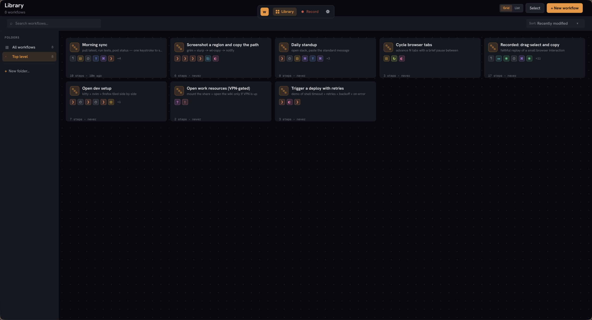
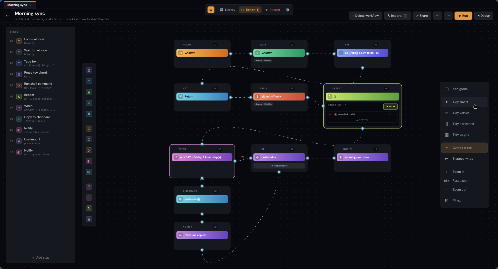
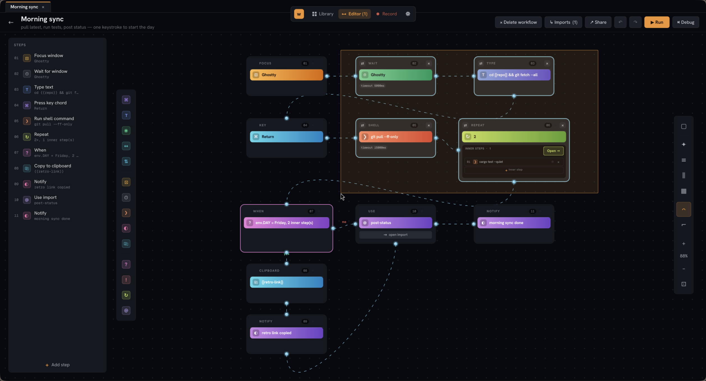
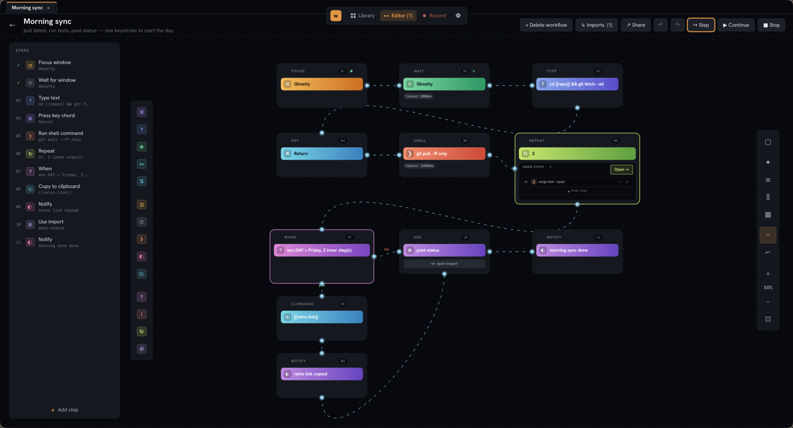

# wflow

**Shortcuts for Linux. GUI editor backed by plain-text workflow files.**



A Qt Quick app for building, editing, recording, and replaying desktop
workflows on Wayland. Pick a template or start blank, edit the steps,
hit Run, watch each step report back. Or skip the editor entirely and
hand-write the file in `$EDITOR`. Both paths produce the same output.

Built on [wdotool-core](https://github.com/cushycush/wdotool) for
input injection — linked in process, no `wdotool` binary required at
runtime.

## The editor

Free-positioning canvas. Drag chips from the palette dock on the left to
drop a step anywhere; wires auto-route between consecutive steps; conditionals
render as branch shapes with explicit yes/no outputs; repeat is a container
with an inline strip of inner rows. Smart Tidy on the right-side tool dock
picks the layout that keeps cards readable at the closest-to-1.0 zoom.



Multi-select with shift- or ctrl-click; lasso a region with shift- or
ctrl-drag; alt-drag to draw a coloured group rectangle behind cards as a
visual annotation. Selection highlights live as the marquee crosses cards.



Step-by-step debugger. ⏯ Debug pauses the engine between every action;
Step / Continue / Stop are the controls. The active card pulses; each
step's status dot settles to green / red / grey on outcome. Repeat
inner steps each get their own dot and pulse on every iteration so loops
are easy to read.



## Install

### Arch Linux

```sh
paru -S wflow-bin          # prebuilt binary, ~5s install
paru -S wflow              # builds from source, ~5min on a fast machine
paru -S wflow-git          # tracks main, builds from source
```

`wflow-bin` is the same binary the GitHub release ships. Install
it if you want to skip the cargo build; install `wflow` if you
prefer a from-source build with your local rustc + LTO.

PKGBUILDs in [`packaging/aur/`](packaging/aur/) for local builds.

### From source

Requires Rust 1.77+ and Qt 6 development headers (`qt6-base`,
`qt6-declarative` on Arch; `qt6-base-dev`, `qt6-declarative-dev` on
Debian/Ubuntu).

```sh
cargo install --path . --locked
```

For desktop notifications and clipboard actions, install
`libnotify` (for `notify-send`) and `wl-clipboard` (for `wl-copy`)
through your distro. Input/window automation goes through
`wdotool-core` linked into wflow itself — no separate binary to
install.

### Prebuilt tarball

Each release attaches an `x86_64-unknown-linux-gnu.tar.gz`. See the
[latest release](https://github.com/cushycush/wflow/releases/latest);
the bundled `INSTALL.txt` walks through the install. Requires Qt 6
runtime libs.

### Flatpak

Manifest is in [`packaging/flatpak/`](packaging/flatpak/). Flathub
submission lands once the last host-machine verification item closes.
For now: build locally with `./packaging/flatpak/build-local.sh`.

## Building a workflow

Launch wflow. The first time, you get a welcome card with two paths:

- **`+ New workflow`** opens a dialog with three tabs:
  - **Blank** drops you into the editor with no steps and a tooltip
    on `+ Add step` showing what to do first.
  - **From template** lists eight hand-authored examples covering
    shell, key chords, window focus, conditionals, retries, fragment
    imports, and the full Record-mode output shape. Pick one, it
    copies into your library, and the editor opens on the copy.
  - **Record** opens the recorder. Walk through the actions you want
    to replay, stop, the captured stream becomes a new workflow.
- **`● Record`** shortcuts straight to the recorder if you already
  know that's what you want.

Record uses `org.freedesktop.portal.RemoteDesktop` on Plasma 6 and
GNOME 46+ (explicit consent dialog, no extra permissions). On
Hyprland, Sway, and other wlroots compositors that don't ship the
portal interface yet, Record falls back to reading
`/dev/input/event*` directly via `evdev`. That requires being in
the `input` group, which you can do with
`sudo usermod -aG input $USER` (then log out and back in). If
neither path is available, Record shows a clear setup error
instead of silently capturing nothing.

The editor is split: step list on the left, inspector on the right.
The inspector shows the value field plus per-action options (skip,
on-error, retries / backoff / timeout for shell, clear-modifiers for
key, delay-per-character for type). Saving is automatic, debounced
~600ms after your last keystroke. The save indicator at the top tells
you where it is in the cycle.

Hit **Run** to execute. Each step reports an outcome (`✓ ok`, `· skipped`,
`✗ error`) inline in the step list as the engine works through them.
Use **`Run --dry-run`** equivalents from the CLI if you want a no-op
preview, or **`wflow run --explain`** to see the literal subprocess
commands each step would invoke.

## Workflows as plain text

What's actually on disk is a single [KDL](https://kdl.dev) file per
workflow. Diff it in git, hand-edit it in `$EDITOR`, share it as a
single file. No proprietary container, no binary blob.

```kdl
workflow "Morning standup" {
    subtitle "open slack, focus the channel, paste the daily message"

    vars {
        channel "#standup-platform"
    }

    shell "hyprctl dispatch exec 'slack'"
    wait-window "Slack" timeout="20s"
    focus "Slack"
    key "ctrl+k" clear-modifiers=#true
    type "{{channel}}" delay-ms=15
    key "Return"
    shell "date +%H:%M" as="now"
    notify "standup ready" body="checked in at {{now}}"
}
```

Same workflow as the screenshot above. The GUI is a view onto this
file. Edit either side, the other catches up.

The full vocabulary (every action, every property, how each one runs)
is in [`docs/KDL.md`](docs/KDL.md). Variables, conditionals (`when` /
`unless`), loops (`repeat`), shared fragments (`include` / `imports`),
shell retries with backoff, window-wait predicates: all there.

The filename is the id. `dev-setup.kdl` runs as `wflow run dev-setup`.
Timestamps live in `~/.config/wflow/workflows.toml`, not the workflow
file, so a `git diff` shows what you actually changed.

### Where workflows live

```
$XDG_CONFIG_HOME/wflow/workflows/
```

Usually `~/.config/wflow/workflows/`. One `.kdl` file per workflow.
Put the directory under git if you want version-controlled automation.

### Examples

[`examples/`](examples/) has seven workflows showing every feature of
the language. Same set the GUI's `From template` tab pulls from. Read
the [examples README](examples/README.md) for the matrix of which
example covers which feature.

### Safety

Workflows run shell commands with your user's privileges. The first
time you run a workflow file wflow didn't write itself, you get a
prompt with a categorized step summary. See [`REVIEW.md`](REVIEW.md)
for the trust model and the patterns to look for in workflows from
strangers.

## CLI

The GUI is the front door. The CLI is for cron, keybinds, and
pipelines. Same engine, no Qt.

```sh
wflow run morning-standup              # by id from the library
wflow run ./path/to/file.kdl --yes     # by path, skip the trust prompt
wflow run --dry-run ...                # don't execute, just print
wflow run --explain ...                # print the literal subprocess commands
wflow list                             # show the library
wflow show morning-standup             # pretty-print the steps
wflow validate examples/*.kdl          # parse, no execution (CI-friendly)
wflow doctor                           # check required binaries on PATH
wflow migrate                          # convert pre-v0.4 files in place
wflow new "title"                      # scaffold a new workflow
wflow ids                              # one-per-line, for shell completion
```

Exit codes: `0` success, `1` parse or load error, `2` a step failed at
runtime, `3` non-TTY without `--yes` on an untrusted workflow.

Shell completions install via `wflow completions {bash,zsh,fish}`. The
full man page is `wflow man` (one page per subcommand if you pass
`--output DIR`).

## Status

- **v0.1.0** — CLI runner, first cut of the KDL format, GUI as a viewer.
- **v0.2.0** — Full KDL language; GUI editor with value/option/title
  editing, add/delete/reorder; real ashpd + libei Record backend; man
  pages; AUR PKGBUILDs; dual MIT/Apache-2.0 license.
- **v0.3.0** — First public release. Welcome card + New-workflow dialog
  with templates; first-run trust prompt for unfamiliar workflow files
  (CLI + GUI, see [`REVIEW.md`](REVIEW.md)); Flatpak manifest with
  host-spawn redirect; GitHub Actions CI + draft-release-on-tag.
- **next** — Record-mode event coalescing (collapse Move floods, merge
  text events into Type, assemble chords from modifier+key); flow-
  control editing in the GUI (currently `$EDITOR` only); cross-platform
  CI matrix; Flathub submission.

See `CLAUDE.md` for architecture notes and design decisions.

## License

Licensed under either of

- Apache License, Version 2.0 ([LICENSE-APACHE](LICENSE-APACHE) or
  <http://www.apache.org/licenses/LICENSE-2.0>)
- MIT License ([LICENSE-MIT](LICENSE-MIT) or
  <https://opensource.org/licenses/MIT>)

at your option.

Unless you explicitly state otherwise, any contribution intentionally
submitted for inclusion in this project, as defined in the Apache 2.0
license, shall be dual-licensed as above, without any additional terms
or conditions.
